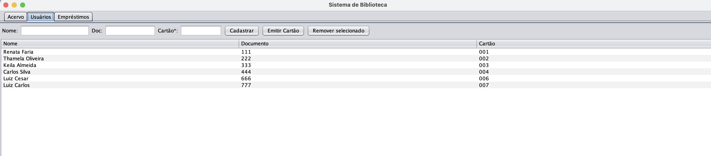
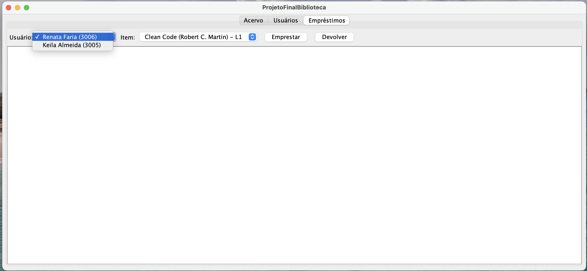
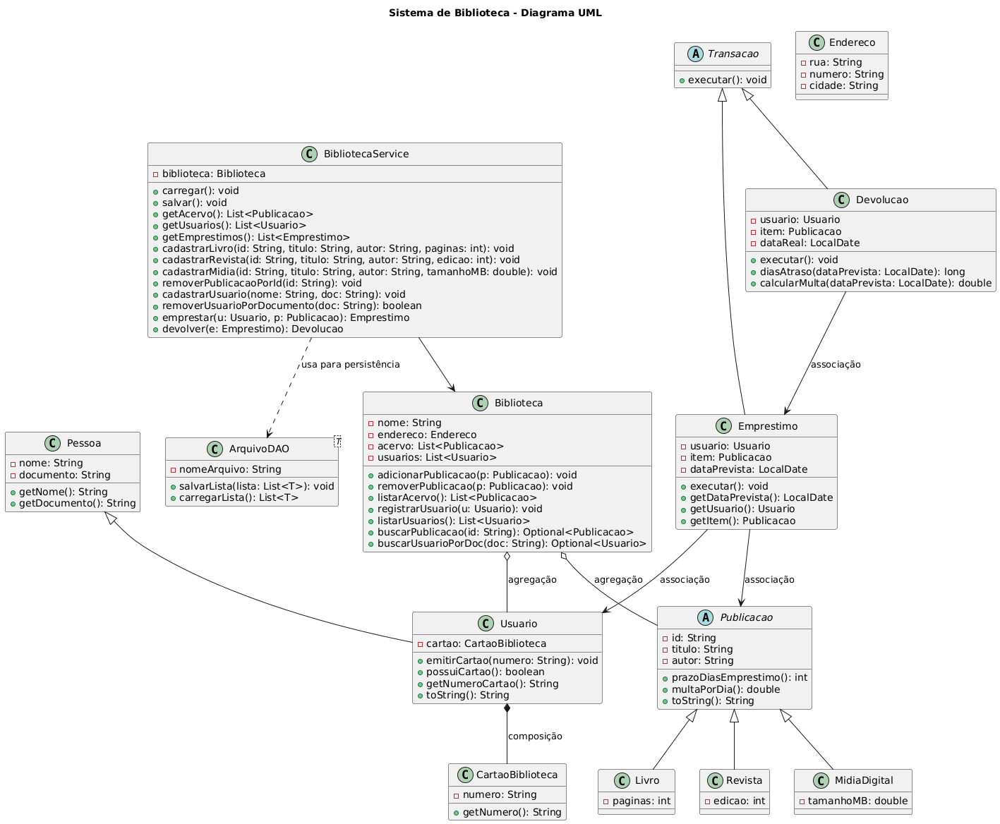

# 📚 Sistema de Biblioteca


Sistema desenvolvido como parte do trabalho acadêmico para modelar e implementar um **sistema orientado a objetos** com **Java**.  
O projeto permite gerenciar o **acervo de uma biblioteca**, **usuários**, **empréstimos** e **devoluções**, aplicando conceitos fundamentais de **POO** e **persistência de dados**.

---

## ✨ **Funcionalidades**
- **Gerenciamento do acervo**
  - Cadastrar livros, revistas e mídias digitais
  - Validar **ID único** para publicações
  - Remover publicações cadastradas
- **Gerenciamento de usuários**
  - Cadastrar usuários
  - Emitir **cartão da biblioteca**
- **Empréstimos e devoluções**
  - Emprestar publicações para usuários
  - Registrar devoluções
  - Calcular **multas por atraso**
- **Persistência**
  - Todos os dados são salvos em arquivos `.dat`
- **Interface gráfica**
  - GUI intuitiva com **Swing** e três abas:
    - **Acervo**
    - **Usuários**
    - **Empréstimos**

---

## 🖼️ **Prints da Aplicação**

### **Aba Acervo**


### **Aba Usuários**


### **Aba Empréstimos**



---

## 🧩 **Modelagem UML**
O sistema foi modelado com foco nos conceitos de **POO**:

- **Herança:** `Livro`, `Revista` e `MidiaDigital` herdam de `Publicacao`
- **Polimorfismo:** métodos `prazoDiasEmprestimo()` e `multaPorDia()` implementados de forma diferente para cada tipo de publicação
- **Composição:** `Usuario` contém um `CartaoBiblioteca`
- **Agregação:** `Biblioteca` gerencia listas de `Publicacao` e `Usuario`
- **Associação:** `Emprestimo` relaciona `Usuario` com `Publicacao`

### **Diagrama UML**



---

## 🛠️ **Tecnologias Utilizadas**
- **Java 17+**
- **Swing** – interface gráfica
- **PlantUML** – modelagem UML
- **Java IO** – persistência de dados
- **Collections API** – manipulação de listas

---

## 🚀 **Como Executar**
1. **Clone o repositório**
   ```bash
   git clone https://github.com/seu-usuario/sistema-biblioteca.git
   ```

2. **Abra no Eclipse**
   - `File → Import → Existing Projects into Workspace`
   - Selecione a pasta do projeto.

3. **Compile e rode**
   - Execute a classe **`MainGUI`**:
     ```
     src/br/aplicacao/MainGUI.java
     ```
   - A interface gráfica será aberta.

---

## 📂 **Estrutura do Projeto**
```
ProjetoFinalBiblioteca/
├── src/
│   ├── br/biblioteca/modelo/
│   ├── br/biblioteca/dao/
│   ├── br/biblioteca/servico/
│   ├── br/biblioteca/ui/
│   └── br/aplicacao/
├── acervo.dat
├── usuarios.dat
├── diagramas/
│   └── uml.png
├── prints/
│   ├── acervo.png
│   ├── usuarios.png
│   └── emprestimos.png
└── README.md
```

---

## 📌 **Manual do Usuário**
1. **Cadastrar publicações:**  
   - Vá até a aba **Acervo**  
   - Preencha os campos necessários  
   - Clique em **Adicionar**.
2. **Remover publicações:**  
   - Selecione um item da tabela  
   - Clique em **Remover selecionado**.
3. **Cadastrar usuários:**  
   - Vá até a aba **Usuários**  
   - Preencha nome e documento  
   - Clique em **Cadastrar**.
4. **Emitir cartão:**  
   - Informe o número do cartão  
   - Ou clique em **Emitir cartão** para usuários existentes.
5. **Registrar empréstimos e devoluções:**  
   - Na aba **Empréstimos**  
   - Selecione usuário e item  
   - Clique em **Emprestar** ou **Devolver**.

---

## 🧑‍💻 **Autor**
**Renata Menezes de Faria**<br>
**Thamela Cristina Rodrigues de Olieveira**<br>
**Keila Almeida Santana**<br>
**Samuel Victor Alventino Silva** <br>
> Trabalho desenvolvido para disciplina de Programação Orientada a Objetos.
