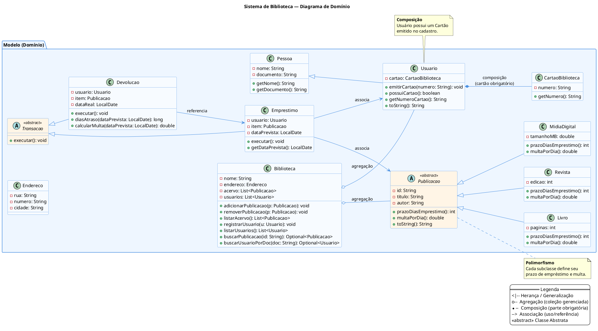
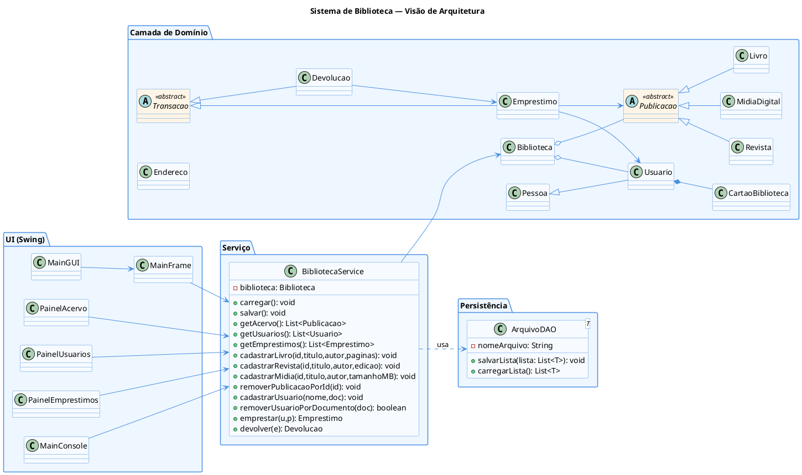

# Relatório — Sistema de Biblioteca (POO com Java)

## 1. Capa
**Sistema de Biblioteca**  
Trabalho Acadêmico — Programação Orientada a Objetos (Java)  
Autores: Renata Menezes de Faria; Thamela Cristina Rodrigues de Oliveira; Keila Almeida Santana; Samuel Victor Alventino Silva.

---

## 2. Introdução
Este relatório apresenta o desenvolvimento de um Sistema de Biblioteca utilizando Programação Orientada a Objetos (POO) em Java. O objetivo foi modelar um problema do mundo real aplicando herança, polimorfismo, composição, agregação, persistência e interface gráfica.

O sistema permite gerenciar o acervo (livros, revistas e mídias digitais), usuários (com cartão obrigatório), empréstimos e devoluções. Os dados são persistidos em arquivos binários (`*.dat`) e a interface gráfica foi construída com Java Swing. Também há um modo console para operações básicas.

---

## 3. Modelagem Conceitual (UML)
A seguir estão dois diagramas PlantUML para gerar as imagens no site PlantUML/PlantText/Kroki.

### 3.1. Diagrama de Domínio
> Foco nas entidades de negócio e seus relacionamentos.



### 3.2. Visão de Arquitetura
> Mostra as camadas (Domínio, Serviço, Persistência e UI) e as dependências.



---

## 4. Aplicação dos Conceitos de POO (exemplos do projeto)

### 4.1. Herança e Polimorfismo
`Publicacao` é abstrata; `Livro`, `Revista` e `MidiaDigital` implementam prazos e multas distintos:
```java
public abstract class Publicacao implements Serializable {
    private String id, titulo, autor;
    public abstract int prazoDiasEmprestimo();
    public abstract double multaPorDia();
}

public class Livro extends Publicacao {
    private int paginas;
    @Override public int prazoDiasEmprestimo() { return 14; }
    @Override public double multaPorDia() { return 1.50; }
}
```

### 4.2. Classe Abstrata e Polimorfismo de Comportamento
`Transacao` define `executar()`; `Emprestimo` e `Devolucao` implementam comportamentos diferentes:
```java
public abstract class Transacao implements Serializable {
    public abstract void executar() throws Exception;
}

public class Emprestimo extends Transacao {
    private Usuario usuario;
    private Publicacao item;
    private LocalDate dataPrevista;
    @Override
    public void executar() {
        dataPrevista = LocalDate.now().plusDays(item.prazoDiasEmprestimo());
    }
}
```

### 4.3. Composição
`Usuario` contém um `CartaoBiblioteca` (parte-obrigatória emitida no cadastro):
```java
public class Usuario extends Pessoa {
    private CartaoBiblioteca cartao;
    public void emitirCartao(String numero) {
        if (cartao != null) throw new IllegalStateException("Usuário já possui cartão.");
        cartao = new CartaoBiblioteca(numero, this);
    }
}
```

### 4.4. Agregação
`Biblioteca` agrega coleções de `Publicacao` e `Usuario`:
```java
public class Biblioteca implements Serializable {
    private List<Publicacao> acervo = new ArrayList<>();
    private List<Usuario> usuarios = new ArrayList<>();
    public void adicionarPublicacao(Publicacao p) { acervo.add(p); }
    public void registrarUsuario(Usuario u) { usuarios.add(u); }
}
```

### 4.5. Persistência (DAO simples em arquivo)
`BibliotecaService` usa `ArquivoDAO<T>` para salvar/carregar listas:
```java
public class BibliotecaService implements Serializable {
    private final ArquivoDAO<Publicacao> acervoDAO = new ArquivoDAO<>("acervo.dat");
    private final ArquivoDAO<Usuario> usuariosDAO = new ArquivoDAO<>("usuarios.dat");
    private final ArquivoDAO<Emprestimo> emprestimosDAO = new ArquivoDAO<>("emprestimos.dat");

    public void carregar() throws IOException {
        biblioteca.carregarAcervo(acervoDAO.carregarLista());
        biblioteca.carregarUsuarios(usuariosDAO.carregarLista());
        biblioteca.carregarEmprestimos(emprestimosDAO.carregarLista());
    }
}
```

---

## 5. Uso de Bibliotecas
- **Java Swing** — construção da interface gráfica (JFrame, JPanel, JTable, etc.).  
- **Java IO** — serialização simples para persistência em arquivos `.dat`.  
- **Collections API** — uso de `List`, `ArrayList`, `Optional`, `Stream`.  
- **PlantUML** — criação dos diagramas UML.  

---

## 6. Manual do Usuário

### 6.1. Interface Gráfica (Swing)
- **Aba Acervo**: cadastrar (Livro, Revista, Mídia Digital), remover item selecionado.  
- **Aba Usuários**: cadastrar (nome, documento e **cartão obrigatório**), remover selecionado.  
- **Aba Empréstimos**: selecionar usuário e item para emprestar; tabela de empréstimos com opção de devolução.  

### 6.2. Modo Console
Ordem do menu:  
1) Listar acervo  
2) Cadastrar acervo  
3) Remover publicação por ID  
4) Listar usuários  
5) Cadastrar usuário (**cartão obrigatório**)  
6) Remover usuário  
7) Listar empréstimos  
8) Realizar empréstimo  
9) Devolver empréstimo  

*Em cadastros, digite `v` para **voltar** ao menu sem salvar.*

---

## 7. Conclusão
O projeto atende aos critérios do estudo de caso: diversidade de entidades; herança, polimorfismo, composição e agregação; persistência; e interação com o usuário por GUI e console. O sistema é extensível (novos tipos de publicação, relatórios, filtros) e serve como base sólida para trabalhos futuros.

---

## 8. Repositório e Arquivos Úteis
- **README.md** atualizado.
- **Diagramas PlantUML**: `uml_dominio.puml`, `uml_completo.puml` (este arquivo inclui os códigos abaixo).

> Gere as imagens colando o conteúdo dos blocos PlantUML acima em:  
> - https://www.planttext.com/ (recomendado)  
> - https://www.plantuml.com/plantuml  
> - https://kroki.io/